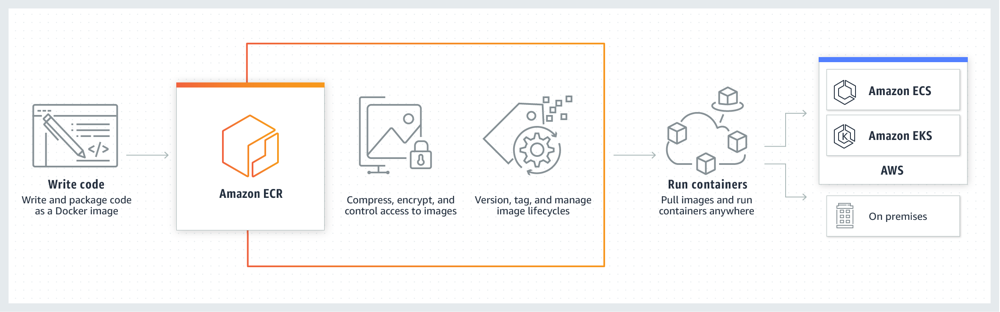

# ICARUS API

## Overview

- [ICARUS API](#icarus-api)
  - [Overview](#overview)
  - [Docker Image Deployment Guide](#docker-image-deployment-guide)
    - [Prerequisites](#prerequisites)
  - [Building and Pushing Docker Image to ECR](#building-and-pushing-docker-image-to-ecr)
    - [Step 1: Build Docker Image Locally](#step-1-build-docker-image-locally)
    - [Step 2: Verify or Create ECR Repository](#step-2-verify-or-create-ecr-repository)
    - [Step 3: Authenticate Docker with ECR](#step-3-authenticate-docker-with-ecr)
    - [Step 4: Tag and Push the Docker Image to ECR](#step-4-tag-and-push-the-docker-image-to-ecr)
  - [Pulling and Running Docker Image on EC2](#pulling-and-running-docker-image-on-ec2)
    - [Step 5: Configure AWS Credentials on EC2](#step-5-configure-aws-credentials-on-ec2)
    - [Step 6: Authenticate Docker on EC2 with ECR](#step-6-authenticate-docker-on-ec2-with-ecr)
    - [Step 7: Pull and Run Docker Image on EC2](#step-7-pull-and-run-docker-image-on-ec2)

## Docker Image Deployment Guide

This guide outlines the process of building a Docker image locally, pushing it to Amazon Elastic Container Registry (ECR), and then pulling and running the image on an Amazon EC2 instance.



### Prerequisites

Before you begin, ensure you have the following prerequisites installed and configured:

- AWS Account: [Create one](https://aws.amazon.com/free/?gclid=Cj0KCQiA2KitBhCIARIsAPPMEhIpNE83YeDh7Rs2M2agHC-m837QxNmMahhQN1s7mcDH3NVFgOM7hucaApMJEALw_wcB&trk=349e66be-cf8d-4106-ae2c-54262fc45524&sc_channel=ps&ef_id=Cj0KCQiA2KitBhCIARIsAPPMEhIpNE83YeDh7Rs2M2agHC-m837QxNmMahhQN1s7mcDH3NVFgOM7hucaApMJEALw_wcB:G:s&s_kwcid=AL!4422!3!455709741582!e!!g!!aws%20account!10817378576!108173614202&all-free-tier.sort-by=item.additionalFields.SortRank&all-free-tier.sort-order=asc&awsf.Free%20Tier%20Types=*all&awsf.Free%20Tier%20Categories=*all)
- Docker: [Install Docker](https://docs.docker.com/get-docker/)
- AWS CLI: [Install AWS CLI](https://aws.amazon.com/cli/)
- AWS IAM User with necessary permissions for ECR and EC2
- Amazon EC2 instance with Docker installed

## Building and Pushing Docker Image to ECR

### Step 1: Build Docker Image Locally

Navigate to the directory containing your Dockerfile and execute the following command:

```bash
docker build -t <name_of_image> <path_to_dockerfile>
```

Verify the image has been built successfully:

```bash
docker image ls

```

### Step 2: Verify or Create ECR Repository

Create a ECR repository to store there your docker images, otherwise verify that you already have one created and what's it's name.

You can verify using this command:

```bash
aws ecr describe-repositories --repository-names <repository_name> --profile <profile_name> --region <region_of_ecr>
```

If you don't have any repository created you can create one going to [AWS](https://docs.aws.amazon.com/AmazonECR/latest/userguide/repository-create.html) or using the AWS cli:

```bash
aws ecr create-repository --repository-name <repository_name> --profile <profile_name> --region <region_of_ecr>
```

### Step 3: Authenticate Docker with ECR

Run the following command to obtain an authentication token and log in to Amazon ECR:

```bash
aws ecr get-login-password --profile <profile_name> --region <region_of_ecr> | docker login --username AWS --password-stdin <ecr_uri>
```

### Step 4: Tag and Push the Docker Image to ECR

Tag the local Docker Image with ECR URI:

```bash
docker tag <name_of_docker_image> <ecr_uri>

```

And push the docker image to AWS ECR:

```bash
docker push <ecr_uri>

```

After this verify that the image is now available in your ECR repository.

## Pulling and Running Docker Image on EC2

Before pulling the Docker image on your EC2 instance, ensure that your IAM role has the necessary ECR permissions to successfully pull images.

Otherwise you might need to attach IAM policies to the EC2 instance to allow it to read from the Amazon ECR repository. You can attach the following policies to your EC2 IAM role:

- AmazonEC2ContainerRegistryReadOnly
- ... (any additional policies based on your specific requirements)

These policies grant the necessary permissions for the EC2 instance to pull the Docker image from the specified ECR repository.

### Step 5: Configure AWS Credentials on EC2

Ensure AWS CLI is installed on the EC2 instance and configure it with the necessary credentials:

```bash
aws --version
```

To configure credentials you can run the command below and follow their instructions.

```bash
aws configure
```

### Step 6: Authenticate Docker on EC2 with ECR

Run the following command to obtain an authentication token and log in to Amazon ECR on the EC2 instance:

```bash
aws ecr get-login-password --region <region> --profile <profile_name> | docker login --username AWS --password-stdin <ecr_uri>
```

### Step 7: Pull and Run Docker Image on EC2

Pull the Docker image from ECR to the EC2 instance:

```bash
docker pull <ecr_uri>:<image_verion>
```

Run the Docker container on the EC2 instance:

```bash
docker run -p <host_port>:<container_port> <ecr_uri>:<image_version>

```

**Verify that you allowed for inbound traffic to the EC2 instance on the port specified.**

After this you can go to your web browser and connect to your app.

```bash
http://<ec2_public_ip>:<host_port>
```
